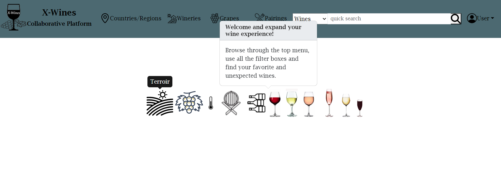

# 🍷 Wine Model Interpretability Framework

A comprehensive machine learning interpretability framework for wine quality prediction, featuring enhanced feature engineering, SHAP explanations, LIME analysis, and rich visualizations.



## 🌟 Key Features

- **🔍 Advanced Interpretability**: SHAP and LIME explanations with meaningful feature names
- **🍇 Enhanced Feature Engineering**: Transform basic wine data into 21+ interpretable features
- **📊 Rich Visualizations**: Interactive plots showing model behavior and feature importance
- **🤖 Multiple ML Models**: Compare LightGBM and XGBoost performance
- **🛠️ Complete Pipeline**: Automated preprocessing, training, and analysis
- **📈 No Target Leakage**: Properly engineered features without data leakage

## 🚀 Quick Start

### Installation

```bash
# Clone the repository
git clone <repository-url>
cd wine-interpretability

# Install dependencies
pip install -r requirements.txt

# Install the package in development mode
pip install -e .
```

### Run Analysis

```bash
# Open the main notebook
jupyter notebook examples/fixed_interpretability_workflow.ipynb

# Or run a quick analysis
python examples/sample_wine_analysis.py
```

## 📊 Enhanced Features

Transform basic wine data into rich, interpretable features:

| **Original (5 features)** | **Enhanced (21+ features)** |
|---------------------------|------------------------------|
| `ABV` | `ABV` + `abv_category` (Low/Medium/High/Very High) |
| `wine_type_encoded` | `Type` + `wine_type_encoded` (Red, White, Sparkling, etc.) |
| `body_encoded` | `Body` + `body_encoded` (Light, Medium, Full-bodied) |
| `acidity_encoded` | `Acidity` + `acidity_encoded` (Low, Medium, High) |
| `rating_count` | `rating_count` + popularity metrics |
| | **🆕 Grape Varieties**: `primary_grape` (46 varieties) |
| | **🆕 Geographic**: `Country` (17 countries), `RegionName` (77 regions) |
| | **🆕 Food Pairings**: `primary_pairing` (16 pairing types) |
| | **🆕 Wine Characteristics**: `is_blend`, `Elaborate` method |
| | **🆕 Derived Features**: `grape_count`, `vintage_count`, `vintage_range` |

## 🎯 Results Comparison

### Before Enhancement
```
LIME Feature Importance:
- 13.0: 0.045    # Cryptic number
- 1.0: 0.032     # Meaningless
- 4.0: 0.028     # Unclear
```

### After Enhancement
```
LIME Feature Importance:
- Chardonnay: 0.045      # Clear grape variety
- France: 0.032          # Interpretable country
- Beef pairing: 0.028    # Meaningful food pairing
- Bordeaux: 0.025        # Recognizable region
- Single varietal: 0.022 # Wine characteristic
```

## � Peroject Structure

```
wine_interpretability/
├── 🍷 wine_interpretability/     # Core package
│   ├── models/                   # ML model trainers
│   │   ├── lightgbm_trainer.py   # LightGBM implementation
│   │   └── xgboost_trainer.py    # XGBoost implementation
│   ├── explainers/               # Interpretability tools
│   │   ├── shap_explainer.py     # SHAP explanations
│   │   ├── lime_explainer.py     # LIME explanations
│   │   └── comparison.py         # Compare explanations
│   ├── visualizers/              # Plotting and visualization
│   │   └── export.py             # Export visualizations
│   ├── utils/                    # Data processing utilities
│   │   ├── data_loader.py        # Data loading
│   │   ├── feature_processor.py  # Feature engineering
│   │   └── data_exporter.py      # Export results
│   ├── config.py                 # Configuration classes
│   └── main.py                   # Main application interface
├── 📓 examples/                  # Example notebooks and scripts
│   ├── fixed_interpretability_workflow.ipynb  # Main notebook
│   ├── global_explanation_example.py          # SHAP examples
│   ├── local_explanation_example.py           # LIME examples
│   └── outputs/                  # Analysis results
├── 🛠️ utils/                     # Utility scripts
│   └── enhanced_data_loader.py   # Enhanced feature engineering
├── 📊 data/                      # Processed datasets
│   ├── enhanced_wine_analysis_data.csv  # 21-feature dataset
│   └── wine_analysis_data_fixed.csv     # Original clean dataset
├── 📁 Dataset/                   # Raw datasets
│   └── last/                     # XWines dataset files
└── 📚 docs/                      # Documentation and images
```

## 🔬 Analysis Workflow

### 1. Data Enhancement
```python
from utils.enhanced_data_loader import create_enhanced_wine_features_from_merged

# Transform 5 basic features into 21+ enhanced features
data = create_enhanced_wine_features_from_merged(
    data_path="data/wine_analysis_data_fixed.csv",
    standardize=True,
    imputation_strategy='median'
)
```

### 2. Model Training
```python
from wine_interpretability.main import WineInterpretabilityApp
from wine_interpretability.config import *

# Configure and train models
config = PipelineConfig(
    model_config=ModelConfig(model_type=ModelType.LIGHTGBM),
    explanation_config=ExplanationConfig(lime_num_features=10),
    visualization_config=VisualizationConfig(figure_size=(14, 10))
)

app = WineInterpretabilityApp(config)
results = app.run_complete_analysis('data/enhanced_wine_analysis_data.csv', 'quality')
```

### 3. Interpretability Analysis
- **SHAP Global**: Feature importance across all predictions
- **SHAP Local**: Individual prediction explanations
- **LIME**: Local interpretable explanations with feature names
- **Comparison**: Side-by-side SHAP vs LIME analysis

## 📈 Visualizations

The framework generates comprehensive visualizations:

- **🎯 SHAP Beeswarm Plots**: Global feature importance with value distributions
- **📊 LIME Bar Charts**: Local explanations for individual predictions
- **🌊 SHAP Waterfall**: Step-by-step prediction breakdown
- **📈 Feature Importance**: Model-based feature rankings
- **🔄 Explanation Comparison**: SHAP vs LIME consistency analysis

## 🛠️ Configuration Options

### Model Configuration
```python
ModelConfig(
    model_type=ModelType.LIGHTGBM,  # or XGBOOST
    optimization_trials=20,
    cross_validation_folds=5,
    hyperparameter_space={...}
)
```

### Explanation Configuration
```python
ExplanationConfig(
    shap_explainer_type=SHAPExplainerType.TREE,
    lime_num_features=10,           # Number of features to show
    lime_num_samples=2000,          # LIME sampling size
    background_samples=100          # SHAP background samples
)
```

### Visualization Configuration
```python
VisualizationConfig(
    figure_size=(14, 10),
    dpi=150,
    save_format="png",
    show_plots=True
)
```

## 📊 Dataset Information

### XWines Dataset
- **Source**: XWines wine recommendation dataset
- **Wines**: 100 wines with detailed characteristics
- **Ratings**: 1,000+ user ratings
- **Features**: Wine type, grape varieties, regions, food pairings, vintages

### Enhanced Features
- **Categorical**: 15+ features including grape varieties, countries, regions
- **Numerical**: 6+ features including ABV, counts, and derived metrics
- **No Target Leakage**: Properly excludes rating-derived features

## 🎯 Use Cases

- **🍷 Wine Industry**: Understand quality drivers for wine production
- **📊 Data Science**: Learn interpretable ML techniques
- **🎓 Education**: Teach feature engineering and model interpretability
- **🔬 Research**: Study explainable AI methods in practice

## 🤝 Contributing

1. Fork the repository
2. Create a feature branch (`git checkout -b feature/amazing-feature`)
3. Commit your changes (`git commit -m 'Add amazing feature'`)
4. Push to the branch (`git push origin feature/amazing-feature`)
5. Open a Pull Request

## 📝 License

This project is licensed under the MIT License - see the [LICENSE](LICENSE) file for details.

## 🙏 Acknowledgments

- **XWines Dataset**: Wine recommendation dataset
- **SHAP**: SHapley Additive exPlanations library
- **LIME**: Local Interpretable Model-agnostic Explanations
- **LightGBM & XGBoost**: Gradient boosting frameworks

## 📞 Support

- 📧 **Issues**: [GitHub Issues](../../issues)
- 📚 **Documentation**: See `docs/` directory
- � **Discussions**: [GitHub Discussions](../../discussions)

---

**Transform your wine quality predictions from cryptic numbers to meaningful insights! 🍷✨**